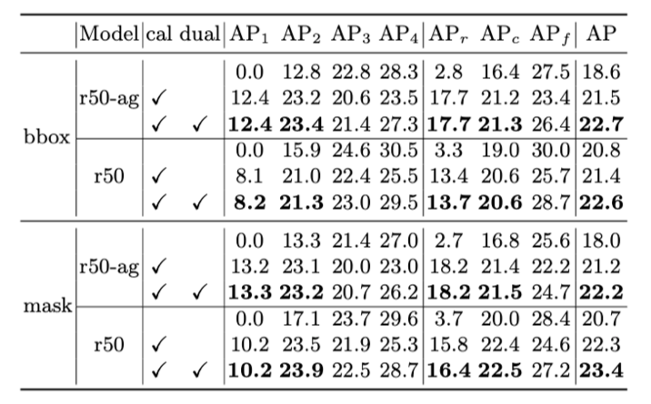
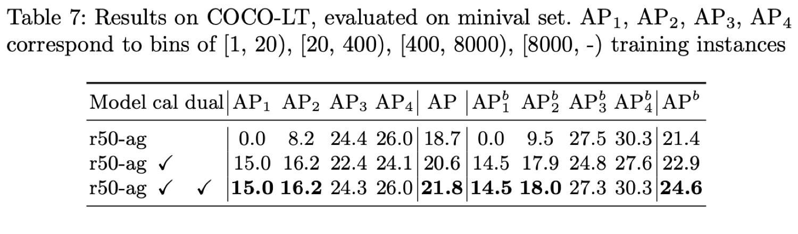
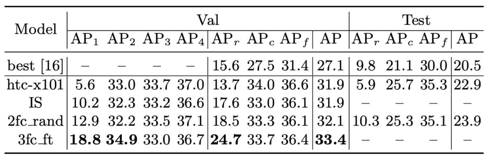

# Implementation of our ECCV 2020 paper [The Devil is in Classification: A Simple Framework for Long-tail Instance Segmentation](https://arxiv.org/pdf/2007.11978)

This repo contains code of Simcal, which won the LVIS 2019 challenge. Note that
it can achieve much higher tail class performance by simply change the calibration head from 2-layer fc with 
random initialization (2fc_rand) to 3-layer fc initialized from original model with standard training (3fc_ft), refer to 
paper for details. 
But we did not notice this during the challenge submission and used 2fc_rand, so much higher result of tail clasees on test set 
is expected with SimCal 3fc_ft.


## License

This project is released under the [Apache 2.0 license](LICENSE).


## TODO
  * [ ] remove and clean redundant and commented codes
  * [ ] update script for installing with pytorch 1.1.0 to have faster calibration training
  * [ ] merge mask r-cnn and htc model test file, add htc calibration code, add Props-GT experiment code

Pull requests to improve the codebase or fix bugs are welcome
  
## Installation

Simcal is based on mmdetection, Please refer to [INSTALL.md](INSTALL.md) for installation and dataset preparation.

Or run the following installation script:
###
    #!/usr/bin/env bash
    conda create -n simcal_mmdet python=3.7
    source ~/anaconda3/etc/profile.d/conda.sh
    conda init bash
    conda activate simcal_mmdet
    echo "python path"
    which python
    conda install pytorch==1.2.0 torchvision==0.4.0 cudatoolkit=9.2 -c pytorch
    pip install cython==0.29.12 mmcv==0.2.16 matplotlib terminaltables
    pip install "git+https://github.com/cocodataset/cocoapi.git#subdirectory=PythonAPI"
    pip install opencv-python-headless
    pip install Pillow==6.1
    pip install numpy==1.17.1 --no-deps
    git clone https://github.com/twangnh/SimCal
    cd SimCal
    pip install -v -e .


To also get instance-centric AP results, please do not install official LVIS api or 
cocoapi with pip, as we have modified it with a local copy
in the repository to
additionally calculate instance centric bin AP results (i.e., AP1,AP2,AP3,AP4). We may create a pull
request to update the official APIs for this purpose later.

## Dataset preparation
For [LVIS](https://www.lvisdataset.org/dataset) dataset, please arrange the data as:

```
SimCal
├── configs
├── data
│   ├── LVIS
│   │   ├── lvis_v0.5_train.json.zip
│   │   ├── lvis_v0.5_val.json.zip
│   │   ├── images
│   │   │   ├── train2017
│   │   │   ├── val2017

```

>note for  LVIS images, you can just create a softlink for the val2017 to point to COCO val2017

For COCO-LT (our sampled long-tail version of COCO, refer to paper for details), please download the sampled
annotation file [train_coco2017_LT_sampled.json](https://drive.google.com/file/d/1cQM7BclPRjikWDhaUGoJNwQD3ia4StlQ/view?usp=sharing)  and put it at
`data/coco/annotations/`

## Training (Calibration)
Calibration uses multi-gpu training to perform bi-level proposal sampling, to run calibration on
a model, e.g., 

    python tools/train.py configs/simcal/calibration/mask_rcnn_r50_fpn_1x_lvis_agnostic.py --use_model 3fc_ft --exp_prefix xxx --gpus 4/8

will use 3fc_ft head as described in the paper and save calibrated head ckpt with exp_prefix

## Pre-trained models and calibrated heads

**All the calibrated models reported in the paper are released for reproduction 
and future research:**

Model | Link
--- |:---:
r50-ag epoch-12 | [Googledrive](https://drive.google.com/file/d/1S0P6doDmx6h2C46gnSY57o2HnHrazSro/view?usp=sharing)
calibrated cls head | [Googledrive](https://drive.google.com/file/d/1yVjzSaZDd5KhyAXmmBg9_XIWuz4sIqRh/view?usp=sharing)

Model | Link
--- |:---:
r50 epoch-12 | [Googledrive](https://drive.google.com/file/d/15reNinLZjQ7x1Nl829JwPt6crWmlvyno/view?usp=sharing)
calibrated cls head | [Googledrive](https://drive.google.com/file/d/1R_JAYm8-jaX-fFB3hADD1VFvw3VisQh0/view?usp=sharing)

Model  | Link
--- |:---:
r50-ag-coco-lt epoch-12 | [Googledrive](https://drive.google.com/file/d/1sCqedvZrWYyHl4msVSzf0wr32e2i8kGi/view?usp=sharing)
calibrated cls head | [Googledrive](https://drive.google.com/file/d/1UJaRUtENmAHLV5aCV7o_RZYXO1aRY5ij/view?usp=sharing)

Model |  Link
--- |:---:
htc-x101 epoch-20 | [Googledrive](https://drive.google.com/file/d/1-YXlLCajaYz0u3ahBt-kUhwyjz9f6WRT/view?usp=sharing)
calhead-stege0| [Googledrive](https://drive.google.com/file/d/1vnKcbw3h6vMXlhKJMfOj4OWf6xxY78KU/view?usp=sharing)
calhead-stege1|  [Googledrive](https://drive.google.com/file/d/1BVPkH0faKayBGQVbOW-xOvMkxqOburEu/view?usp=sharing)
calhead-stege2|  [Googledrive](https://drive.google.com/file/d/15F7ado-ma2EE2Q75uxpECD-18eJaX1mz/view?usp=sharing)


**To evaluate and reproduce the paper result models, please first download the model checkpoints 
and arrange them as:**

```
SimCal
├── configs
├── work_dirs
    |-- htc
    |   |-- 3fc_ft_stage0.pth
    |   |-- 3fc_ft_stage1.pth
    |   |-- 3fc_ft_stage2.pth
    |   `-- epoch_20.pth
    |-- mask_rcnn_r50_fpn_1x_cocolt_agnostic
    |   |-- 3fc_ft.pth
    |   `-- epoch_12.pth
    |-- mask_rcnn_r50_fpn_1x_lvis_agnostic
    |   |-- 3fc_ft.pth
    |   `-- epoch_12.pth
    `-- mask_rcnn_r50_fpn_1x_lvis_clswise
        |-- 3fc_ft_epoch.pth
        |-- 3fc_ft.pth
        `-- epoch_12.pth

```

## Test with pretrained models and calibrated heads
mrcnn on lvis, paper result:



Test LVIS r50-ag model (use --eval bbox for box result)

    ./tools/dist_test.sh configs/simcal/calibration/mask_rcnn_r50_fpn_1x_lvis_agnostic.py 8 --cal_head 3fc_ft --out ./temp.pkl --eval segm
    
    bin 0_10 AP: 0.13286122428874017
    bin 10_100 AP: 0.23243947868384135
    bin 100_1000 AP: 0.20696891455408
    bin 1000_* AP: 0.2615438157753328
    bAP 0.20845335832549858
     Average Precision  (AP) @[ IoU=0.50:0.95 | area=   all | maxDets=300 catIds=all] = 0.222
     Average Precision  (AP) @[ IoU=0.50      | area=   all | maxDets=300 catIds=all] = 0.354
     Average Precision  (AP) @[ IoU=0.75      | area=   all | maxDets=300 catIds=all] = 0.236
     Average Precision  (AP) @[ IoU=0.50:0.95 | area=     s | maxDets=300 catIds=all] = 0.154
     Average Precision  (AP) @[ IoU=0.50:0.95 | area=     m | maxDets=300 catIds=all] = 0.298
     Average Precision  (AP) @[ IoU=0.50:0.95 | area=     l | maxDets=300 catIds=all] = 0.373
     Average Precision  (AP) @[ IoU=0.50:0.95 | area=   all | maxDets=300 catIds=  r] = 0.182
     Average Precision  (AP) @[ IoU=0.50:0.95 | area=   all | maxDets=300 catIds=  c] = 0.215
     Average Precision  (AP) @[ IoU=0.50:0.95 | area=   all | maxDets=300 catIds=  f] = 0.247
     Average Recall     (AR) @[ IoU=0.50:0.95 | area=   all | maxDets=300 catIds=all] = 0.315
     Average Recall     (AR) @[ IoU=0.50:0.95 | area=     s | maxDets=300 catIds=all] = 0.216
     Average Recall     (AR) @[ IoU=0.50:0.95 | area=     m | maxDets=300 catIds=all] = 0.382
     Average Recall     (AR) @[ IoU=0.50:0.95 | area=     l | maxDets=300 catIds=all] = 0.453

Test LVIS r50 model (use --eval bbox for box result)

    ./tools/dist_test.sh configs/simcal/calibration/mask_rcnn_r50_fpn_1x_lvis_clswise.py 8 --cal_head 3fc_ft --out ./temp.pkl --eval segm
    
    bin 0_10 AP: 0.10187003036862649
    bin 10_100 AP: 0.23907519508889202
    bin 100_1000 AP: 0.22468457541750592
    bin 1000_* AP: 0.28687985066050825
    bAP 0.21312741288388318
     Average Precision  (AP) @[ IoU=0.50:0.95 | area=   all | maxDets=300 catIds=all] = 0.234
     Average Precision  (AP) @[ IoU=0.50      | area=   all | maxDets=300 catIds=all] = 0.375
     Average Precision  (AP) @[ IoU=0.75      | area=   all | maxDets=300 catIds=all] = 0.245
     Average Precision  (AP) @[ IoU=0.50:0.95 | area=     s | maxDets=300 catIds=all] = 0.167
     Average Precision  (AP) @[ IoU=0.50:0.95 | area=     m | maxDets=300 catIds=all] = 0.316
     Average Precision  (AP) @[ IoU=0.50:0.95 | area=     l | maxDets=300 catIds=all] = 0.405
     Average Precision  (AP) @[ IoU=0.50:0.95 | area=   all | maxDets=300 catIds=  r] = 0.164
     Average Precision  (AP) @[ IoU=0.50:0.95 | area=   all | maxDets=300 catIds=  c] = 0.225
     Average Precision  (AP) @[ IoU=0.50:0.95 | area=   all | maxDets=300 catIds=  f] = 0.272
     Average Recall     (AR) @[ IoU=0.50:0.95 | area=   all | maxDets=300 catIds=all] = 0.331
     Average Recall     (AR) @[ IoU=0.50:0.95 | area=     s | maxDets=300 catIds=all] = 0.233
     Average Recall     (AR) @[ IoU=0.50:0.95 | area=     m | maxDets=300 catIds=all] = 0.399
     Average Recall     (AR) @[ IoU=0.50:0.95 | area=     l | maxDets=300 catIds=all] = 0.481

mrcnn on cocolt, paper result:




Test COCO-LT r50-ag model (use --eval bbox for box result)

    ./tools/dist_test.sh configs/simcal/calibration/mask_rcnn_r50_fpn_1x_lvis_agnostic.py 8 --cal_head 3fc_ft --out ./temp.pkl --eval segm
    
     Average Precision  (AP) @[ IoU=0.50:0.95 | area=   all | maxDets=100 ] = 0.246
    bin ins nums: [4, 24, 32, 20]
    bins ap: [0.1451797625472811, 0.1796142130031695, 0.27337165679657216, 0.3027201541441131]
    eAP : 0.22522144662278398
     Average Precision  (AP) @[ IoU=0.50      | area=   all | maxDets=100 ] = 0.412
     Average Precision  (AP) @[ IoU=0.75      | area=   all | maxDets=100 ] = 0.257
     Average Precision  (AP) @[ IoU=0.50:0.95 | area= small | maxDets=100 ] = 0.133
     Average Precision  (AP) @[ IoU=0.50:0.95 | area=medium | maxDets=100 ] = 0.278
     Average Precision  (AP) @[ IoU=0.50:0.95 | area= large | maxDets=100 ] = 0.334
     Average Recall     (AR) @[ IoU=0.50:0.95 | area=   all | maxDets=  1 ] = 0.239
     Average Recall     (AR) @[ IoU=0.50:0.95 | area=   all | maxDets= 10 ] = 0.424
     Average Recall     (AR) @[ IoU=0.50:0.95 | area=   all | maxDets=100 ] = 0.450
     Average Recall     (AR) @[ IoU=0.50:0.95 | area= small | maxDets=100 ] = 0.269
     Average Recall     (AR) @[ IoU=0.50:0.95 | area=medium | maxDets=100 ] = 0.481
     Average Recall     (AR) @[ IoU=0.50:0.95 | area= large | maxDets=100 ] = 0.586

htc on lvis, paper result:



Test HTC model (use --eval bbox for box result)

    ./tools/dist_test_htc.sh configs/simcal/calibration/htc_lvis_31d9.py 8 --out ./temp2.pkl --eval segm
    
    bin 0_10 AP: 0.18796762487467375
    bin 10_100 AP: 0.34907335159564473
    bin 100_1000 AP: 0.3304618611020927
    bin 1000_* AP: 0.3674197862439286
    bAP 0.30873065595408494
     Average Precision  (AP) @[ IoU=0.50:0.95 | area=   all | maxDets=300 catIds=all] = 0.334
     Average Precision  (AP) @[ IoU=0.50      | area=   all | maxDets=300 catIds=all] = 0.490
     Average Precision  (AP) @[ IoU=0.75      | area=   all | maxDets=300 catIds=all] = 0.357
     Average Precision  (AP) @[ IoU=0.50:0.95 | area=     s | maxDets=300 catIds=all] = 0.228
     Average Precision  (AP) @[ IoU=0.50:0.95 | area=     m | maxDets=300 catIds=all] = 0.422
     Average Precision  (AP) @[ IoU=0.50:0.95 | area=     l | maxDets=300 catIds=all] = 0.565
     Average Precision  (AP) @[ IoU=0.50:0.95 | area=   all | maxDets=300 catIds=  r] = 0.247
     Average Precision  (AP) @[ IoU=0.50:0.95 | area=   all | maxDets=300 catIds=  c] = 0.337
     Average Precision  (AP) @[ IoU=0.50:0.95 | area=   all | maxDets=300 catIds=  f] = 0.364
     Average Recall     (AR) @[ IoU=0.50:0.95 | area=   all | maxDets=300 catIds=all] = 0.428
     Average Recall     (AR) @[ IoU=0.50:0.95 | area=     s | maxDets=300 catIds=all] = 0.300
     Average Recall     (AR) @[ IoU=0.50:0.95 | area=     m | maxDets=300 catIds=all] = 0.506
     Average Recall     (AR) @[ IoU=0.50:0.95 | area=     l | maxDets=300 catIds=all] = 0.631
     
> note testing with LVIS can be significantly slower as max_det is 300 and det confidence threshold is 0.0

## Props-GT experiment

By Props-GT experiment, we would like to emphasize that there is still large room of improvement along the direction of improving 
object proposal classification.

## Balanced Group Softmax
We also encourage you to  check our following up work [Balanced Group Softmax](https://openaccess.thecvf.com/content_CVPR_2020/papers/Li_Overcoming_Classifier_Imbalance_for_Long-Tail_Object_Detection_With_Balanced_Group_CVPR_2020_paper.pdf) after the LVIS challenge, 
(accepted by CVPR20 oral). It employs a more specific calibration approach with redesigned the softmax function, the calibration is
more effective without dual-head inference, and only calibrates last layer of classification head. Code is available
at [https://github.com/FishYuLi/BalancedGroupSoftmax](https://github.com/FishYuLi/BalancedGroupSoftmax)

## Citation
Please consider to cite our ECCV20 paper:

    @article{wang2020devil,
      title={The Devil is in Classification: A Simple Framework for Long-tail Instance Segmentation},
      author={Wang, Tao and Li, Yu and Kang, Bingyi and Li, Junnan and Liew, Junhao and Tang, Sheng and Hoi, Steven and Feng, Jiashi},
      journal={arXiv preprint arXiv:2007.11978},
      year={2020}
    }

tech report for LVIS challenge 2019 at ICCV19 (Yu Li and Tao Wang have equal contribution for the LVIS challenge):

    @article{wang2019classification,
      title={Classification Calibration for Long-tail Instance Segmentation},
      author={Wang, Tao and Li, Yu and Kang, Bingyi and Li, Junnan and Liew, Jun Hao and Tang, Sheng and Hoi, Steven and Feng, Jiashi},
      journal={arXiv preprint arXiv:1910.13081},
      year={2019}
    }

Our following work Group Softmax at CVPR20 (oral):

    @inproceedings{li2020overcoming,
      title={Overcoming Classifier Imbalance for Long-Tail Object Detection With Balanced Group Softmax},
      author={Li, Yu and Wang, Tao and Kang, Bingyi and Tang, Sheng and Wang, Chunfeng and Li, Jintao and Feng, Jiashi},
      booktitle={Proceedings of the IEEE/CVF Conference on Computer Vision and Pattern Recognition},
      pages={10991--11000},
      year={2020}
    }
```
